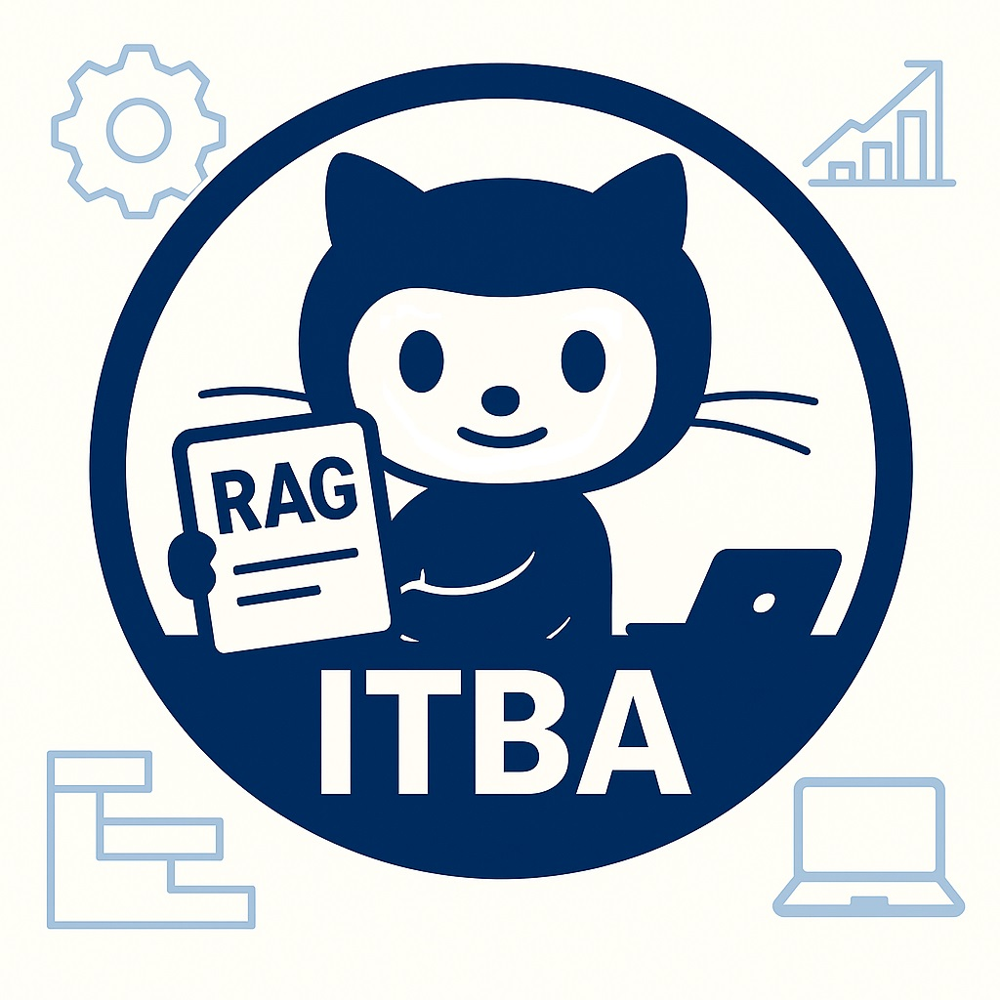

<p align="center">
  
</p>
<h1 align="center">TESIS FIN DE MAESTRÍA</h1>
<h2 align="center">Innovación en entornos empresariales</h2>
<h3 align="center">Sistemas RAG para la Optimización de la Gestión de Proyectos y Análisis Estratégico</h3>
<h4 align="center">ANALIZADOR DE RIESGOS CON IA</h4>
<p align="center">
  <strong>ITBA - Instituto Tecnológico Buenos Aires</strong><br>
  <strong>Maestría en Management & Analytics</strong><br>
  <strong>Alumno: Adriel J. Cuesta</strong>
</p>

Repositorio: [https://github.com/Adrielcuesta/tesismma2026](https://github.com/Adrielcuesta/tesismma2026)

## Descripción del Proyecto

Este proyecto implementa un sistema de **Generación Aumentada por Recuperación (RAG)** enfocado en el análisis de riesgos para proyectos de instalación de maquinaria industrial. El usuario describe un proyecto (o carga un PDF con su descripción) y el sistema identifica, evalúa y detalla riesgos potenciales a partir de una Base de Conocimiento documental, incluyendo responsables de mitigación, una acción concreta y un umbral de alerta medible para cada riesgo.

La interacción principal se realiza a través de una **aplicación web desarrollada con Flask**. El sistema permite **seleccionar dinámicamente entre múltiples Modelos de Lenguaje Grandes (LLMs)**, tanto en la nube (Google Gemini, Groq/Llama, Mistral) como **modelos locales ejecutados enteramente en la máquina del usuario vía Ollama** (Qwen2.5, Llama 3.1, Mistral 7B, Gemma2) — esto último permite correr el sistema y su evaluación completa sin ningún costo de API y sin que los datos salgan de la máquina local.

Para garantizar la precisión, el sistema incorpora un **módulo de re-ranking multilingüe** (`BAAI/bge-reranker-v2-m3`) que optimiza la relevancia del contexto recuperado, en conjunto con un modelo de **embeddings multilingüe** (`BAAI/bge-m3`), elegido específicamente porque toda la Base de Conocimiento y las consultas están en español. Antes de generar el análisis, un **evaluador de evidencia (CRAG-lite)** clasifica si el contexto recuperado es específico, genérico o irrelevante para el proyecto, evitando forzar un análisis sobre evidencia insuficiente. La salida del LLM es validada estrictamente mediante **esquemas Pydantic** (9 campos por riesgo).

Al finalizar, el sistema genera:
- Un **reporte JSON** estructurado con los hallazgos detallados.
- Un **dashboard HTML dinámico e interactivo** con los riesgos, la evidencia utilizada (con scores de relevancia) y un aviso visible cuando la evidencia recuperada es genérica o insuficiente.
- Opcionalmente, un **reporte en formato PDF**.

El proyecto incluye un **arnés de evaluación con Ragas** que permite medir de forma cuantitativa y reproducible la calidad del pipeline RAG, comparando el desempeño entre distintos LLMs (locales y en la nube), con y sin recuperación de contexto (ablation), bajo la misma configuración.

## Características Principales

- **Interfaz Web con Flask:** Gestión de documentos y configuración del análisis.
- **Selección Dinámica de LLMs:** Gemini, Llama 3.3 (vía Groq), Mistral Large, y modelos 100% locales vía Ollama (Qwen2.5 7B, Llama 3.1 8B, Mistral 7B, Gemma2 9B).
- **Pipeline RAG Avanzado (LangChain 1.x / `langchain-classic`):**
  - **Embeddings multilingües:** `BAAI/bge-m3`, elegido por el idioma español de todo el corpus.
  - **Re-ranking de Contexto:** Cross-Encoder multilingüe (`BAAI/bge-reranker-v2-m3`) sobre los `K` fragmentos recuperados antes de pasarlos al LLM.
  - **Evaluador de Evidencia (CRAG-lite):** clasifica la evidencia recuperada como CORRECTO / AMBIGUO / INSUFICIENTE antes de generar el análisis (adaptado de Yan et al., 2024, *Corrective Retrieval Augmented Generation*, sin el componente de búsqueda web del paper original, para mantener el sistema 100% local y auditable). Corre siempre en un modelo local fijo, independiente del modelo elegido para el análisis, para no consumir cuota de ninguna API paga.
- **Validación Estructurada de Salida:** Pydantic garantiza que cada riesgo tenga descripción, tipo, impacto, probabilidad, responsables, una acción de mitigación concreta y un umbral de alerta medible.
- **Reportes Completos y Trazables:** JSON, dashboard HTML interactivo y PDF, con evidencia, score de relevancia, y aviso de calidad de evidencia cuando corresponde.
- **Framework de Evaluación Integrado (Ragas):**
  - Mide `faithfulness`, `answer_relevancy`, `context_precision` y `context_recall`.
  - **Ablation automático RAG vs. sin RAG:** cada modelo se evalúa con y sin acceso a la Base de Conocimiento, en la misma ejecución.
  - **Métricas propias adicionales**, deterministas y sin costo: tasa de cumplimiento de esquema, coherencia interna entre la descripción del riesgo y su acción/umbral, y distribución del evaluador de evidencia.
  - **No requiere ninguna API de pago para evaluar**: tanto el juez de Ragas como el evaluador de evidencia corren en un modelo local vía Ollama.
  - Guardado incremental (no se pierde una ejecución larga si un modelo puntual falla) y log completo de cada ejecución en un archivo `.txt`, además de la consola.
- **Dockerizable:** Incluye `Dockerfile` para creación de imágenes y despliegue.

## Arquitectura Tecnológica

| Componente | Tecnología/Librería Utilizada | Propósito |
| :--- | :--- | :--- |
| **Aplicación Web** | `Flask` | Servidor web, gestión de rutas e interfaz de usuario. |
| **Orquestación de IA** | `LangChain 1.x` + `langchain-classic` | Encadenamiento de componentes RAG, prompts y LLMs. |
| **Modelos de Lenguaje (nube)** | `Google Generative AI`, `Groq API`, `Mistral API` | Gemini, Llama 3.3 (Groq), Mistral Large. |
| **Modelos de Lenguaje (local)** | `Ollama` (endpoint OpenAI-compatible) | Qwen2.5 7B, Llama 3.1 8B, Mistral 7B, Gemma2 9B — sin costo ni límite de cuota. |
| **Base de Datos Vectorial** | `ChromaDB` | Almacenamiento y búsqueda de similitud de embeddings. |
| **Embeddings** | `sentence-transformers` (`BAAI/bge-m3`) | Representaciones vectoriales multilingües del texto. |
| **Re-ranking** | `langchain-classic` + `HuggingFaceCrossEncoder` (`BAAI/bge-reranker-v2-m3`) | Reclasificación multilingüe de fragmentos recuperados. |
| **Evaluación de Evidencia** | Cadena propia (CRAG-lite) sobre modelo local fijo | Clasifica la suficiencia del contexto antes de generar el análisis. |
| **Validación de Datos** | `Pydantic` | Definición y validación de esquemas para la salida del LLM. |
| **Evaluación RAG** | `Ragas` (juez local, sin OpenAI) | Medición cuantitativa del rendimiento del pipeline, con ablation RAG/sin RAG. |
| **Generación de PDF** | `WeasyPrint` | Conversión del dashboard HTML a PDF. |
| **Procesamiento de PDF** | `PyMuPDF` (`fitz`) | Lectura y extracción de texto de documentos PDF. |

## Requisitos Previos

- **Python:** Versión 3.10, 3.11 o 3.12.
- **Git:** Para clonar el repositorio.
- **[Ollama](https://ollama.com/download):** Requerido para los modelos locales, para el juez de Ragas y para el evaluador de evidencia (todos corren en local por diseño, incluso si se elige un modelo en la nube para el análisis). Tras instalarlo, bajar al menos:
  ```bash
  ollama pull qwen2.5:7b-instruct
  ollama pull llama3.1:8b
  ollama pull mistral:7b
  ollama pull gemma2:9b
  ```
  Ollama debe estar corriendo en segundo plano (`http://localhost:11434`) antes de usar la app o el script de evaluación.
- **Docker:** Opcional, si se desea ejecutar la versión dockerizada.
- **API Keys (opcionales):** Solo necesarias si se quiere usar algún modelo en la nube (Gemini, Groq, Mistral). Los modelos locales vía Ollama no requieren ninguna clave real. En `scripts/config.py`, los modelos en la nube están comentados por defecto — descomentarlos para habilitarlos.
- **Microsoft C++ Build Tools (Windows):** Recomendado para dependencias que requieren compilación (`numpy`, `onnxruntime`). Ver [Visual Studio Downloads](https://visualstudio.microsoft.com/es/downloads/) ("Herramientas de compilación para Visual Studio", carga de trabajo "Desarrollo para el escritorio con C++").

## ⚠️ Nota sobre la Base de Conocimiento

La carpeta `datos/BaseConocimiento/` incluye únicamente documentos de libre distribución.

## Estructura del Proyecto

```plaintext
tesismma2026/
├── app.py                      # Aplicación principal Flask
├── Dockerfile                  # Instrucciones para construir la imagen Docker
├── datos/
│   ├── BaseConocimiento/       # PDFs para la base de conocimiento
│   ├── ProyectoAnalizar/       # PDF del proyecto a analizar
│   ├── ChromaDB_V1/            # (Generado) Base de datos vectorial
│   ├── Resultados/
│   │   └── evaluaciones_rag/   # (Generado) CSVs, respaldos JSON y logs de cada ejecución de evaluación
│   └── eval_dataset.jsonl      # Dataset para la evaluación con Ragas (descripciones de proyecto + riesgos esperados)
├── scripts/
│   ├── __init__.py
│   ├── config.py               # Configuración central (rutas, API keys, modelos, embeddings, reranker)
│   ├── schemas.py               # Esquemas Pydantic (incluye RiskItem de 9 campos y clasificación de evidencia)
│   ├── document_utils.py       # Utilidades para procesar PDFs
│   ├── vector_db_manager.py    # Gestión de ChromaDB y embeddings
│   ├── rag_components.py       # Cadena RAG, cadena sin RAG (ablation) y evaluador de evidencia (CRAG-lite)
│   ├── report_utils.py         # Formateo del reporte final
│   ├── dashboard_generator.py  # Generación del dashboard HTML (incluye aviso de calidad de evidencia)
│   ├── pdf_utils.py            # Generación de reportes PDF
│   ├── main.py                 # Orquestador del flujo de análisis
│   ├── descargar_modelo.py     # Utilitario para pre-descargar el modelo de embeddings
│   └── evaluate_rag.py         # Script de evaluación con Ragas (ablation, métricas propias, guardado incremental)
├── static/
│   └── images/                 # Logos e imágenes para la UI
├── .env.example                # Plantilla para las variables de entorno
├── requirements.txt            # Dependencias de Python (versiones fijadas)
└── README.md                   # Este archivo
```

## Configuración y Ejecución Local

1. **Clonar el Repositorio:**
   ```bash
   git clone https://github.com/Adrielcuesta/tesismma2026.git
   cd tesismma2026
   ```

2. **Instalar y arrancar Ollama** (ver Requisitos Previos), y bajar los modelos locales que se quieran usar.

3. **Crear y Activar Entorno Virtual:**
   ```bash
   py -3.12 -m venv venv
   # Windows PowerShell:
   .\venv\Scripts\Activate.ps1
   # Windows CMD:
   # venv\Scripts\activate
   # Linux/macOS:
   # source venv/bin/activate
   ```

4. **Instalar Dependencias:**
   ```bash
   pip install -r requirements.txt
   ```

5. **Configurar Variables de Entorno:**
   * Copiá `.env.example` y renombralo a `.env`.
   * Cargá al menos una clave de API si querés usar modelos en la nube (no es obligatorio si solo vas a usar los modelos locales vía Ollama):
     ```dotenv
     GEMINI_API_KEY="TU_API_KEY_DE_GEMINI"
     GROQ_API_KEY="TU_API_KEY_DE_GROQ"
     MISTRAL_API_KEY="TU_API_KEY_DE_MISTRAL"
     OLLAMA_API_KEY="ollama-local"   # cualquier valor no vacío, Ollama no lo valida
     ```
     Claves gratuitas: [GEMINI](https://aistudio.google.com/app/apikey) · [GROQ](https://console.groq.com/keys)

6. **Ejecutar la Aplicación Web:**
   ```bash
   python app.py
   ```
   Servidor disponible usualmente en `http://127.0.0.1:8080`.

7. **Usar la Aplicación:** seleccioná el modelo LLM, cargá los PDFs de Base de Conocimiento y del proyecto a analizar, e iniciá el análisis.

## Evaluación del Pipeline con Ragas

1. **Preparar el Dataset de Evaluación:** `datos/eval_dataset.jsonl` contiene descripciones de proyecto realistas (no preguntas de definición) junto con el perfil de riesgos esperado como `ground_truth` — esto refleja la tarea real del sistema (identificación de riesgos a partir de una descripción de proyecto, no respuesta a preguntas de examen).

2. **Ejecutar el Script de Evaluación:**
   ```bash
   python -m scripts.evaluate_rag
   ```
   El script itera sobre todos los modelos activos en `config.py` (comentá los que no quieras evaluar), y por cada uno evalúa **con y sin RAG** (ablation automático), calculando `faithfulness`, `answer_relevancy`, `context_precision` y `context_recall` (estas tres últimas solo aplican al modo con RAG) usando un modelo local (vía Ollama) como juez — **no se necesita ninguna clave de OpenAI para evaluar**.

3. **Resultados:** por cada ejecución se generan, en `datos/Resultados/evaluaciones_rag/`:
   * `ragas_eval_TODOS_<timestamp>.csv` — se actualiza incrementalmente después de cada modelo/modo, no solo al final.
   * `metricas_propias_<timestamp>.csv` — cumplimiento de esquema, coherencia interna acción/umbral, y distribución del evaluador de evidencia (CORRECTO/AMBIGUO/INSUFICIENTE), por modelo.
   * `respuestas_crudas_<modelo>_<timestamp>.json` — respaldo de las respuestas generadas por cada modelo, antes de puntuarlas.
   * `log_ejecucion_<timestamp>.txt` — log completo de la ejecución.

## Ejecución con Docker (Opcional)

```bash
docker build -t mi-analizador-riesgos .
docker run -p 8080:8080 --rm mi-analizador-riesgos
```
Accedé a `http://localhost:8080`. Verificá que tu `.env` tenga las claves necesarias antes de construir la imagen.

## Solución de Problemas Comunes

* **Error de `metadata-generation-failed` durante `pip install` en Windows:** instalá las Microsoft C++ Build Tools (ver Requisitos Previos) y reiniciá la PC.

* **`ModuleNotFoundError: No module named 'langchain_classic'`:** falta esa dependencia en el entorno — confirmá que está en `requirements.txt` y corré `pip install -r requirements.txt` de nuevo.

* **`ModuleNotFoundError: No module named 'langchain_community.chat_models.vertexai'` al correr `evaluate_rag.py`:** es un bug conocido de la versión de `ragas` usada, no relacionado con este proyecto — `evaluate_rag.py` ya incluye un workaround al principio del archivo que lo evita; no debería aparecer si no se modificó esa sección.

* **`Rate limit` / `RESOURCE_EXHAUSTED` al evaluar con modelos en la nube:** cada proveedor (Gemini, Groq, Mistral) tiene cuotas gratuitas distintas y bastante ajustadas. Comentá en `config.py` el modelo que se quedó sin cuota y seguí con el resto — el script salta automáticamente los modelos sin API key o los que fallan, y guarda lo que sí se completó.

* **Un modelo de la nube falla siempre, con el mismo error, en cualquier pregunta:** revisá el mensaje de error específico en el log (`log_ejecucion_<timestamp>.txt`) — puede ser una clave inválida, un modelo dado de baja por el proveedor (verificar el nombre exacto vigente en su documentación), o una restricción del nivel de suscripción de la cuenta.

* **`API Key not found` al usar un LLM en la nube:** verificá que `.env` exista y que el nombre de la variable coincida exactamente con lo esperado en `scripts/config.py`.

* **Los modelos locales no responden / error de conexión a `localhost:11434`:** confirmá que Ollama esté corriendo (abrí `http://localhost:11434` en el navegador, debería decir "Ollama is running") y que el modelo esté descargado (`ollama list`). Esto aplica también si se eligió un modelo en la nube para el análisis: el evaluador de evidencia (CRAG-lite) y el juez de Ragas siempre requieren Ollama activo.

* **`ModuleNotFoundError` al ejecutar un script desde la terminal:** los scripts usan importaciones relativas. Ejecutalos como módulo desde la carpeta raíz: `python -m scripts.evaluate_rag` (no `python evaluate_rag.py` desde adentro de `scripts/`).

* **Errores con WeasyPrint al generar PDF (Linux/macOS):** puede requerir instalar `pango`, `cairo` y `gdk-pixbuf` a nivel de sistema. Ver [documentación de WeasyPrint](https://weasyprint.readthedocs.io/en/stable/install.html).

## Pasos Futuros y Escalabilidad

1. **Migración de la Base de Datos Vectorial** a una solución gestionada en la nube (Pinecone, Weaviate, Vertex AI Vector Search) para mejorar escalabilidad y concurrencia.
2. **Descomposición de consultas:** dividir descripciones de proyecto que abarcan múltiples áreas de riesgo en sub-consultas específicas (usando un modelo local orquestador), recuperar y re-rankear por cada una, y combinar los resultados deduplicados — para no limitar la cobertura a un único conjunto de K fragmentos sobre toda la descripción a la vez.
3. **Búsqueda sistemática de hiperparámetros de recuperación** (tamaño de fragmento, overlap, K, top_n) sobre el corpus específico de este proyecto; la literatura reciente sugiere un tamaño de fragmento mayor al actual como punto de partida a validar.
4. **Ajuste fino (fine-tuning)** de los modelos locales mediante técnicas eficientes en parámetros (LoRA/QLoRA), condicionado a construir un dataset de entrenamiento etiquetado.
5. **Extensión del evaluador de evidencia (CRAG-lite)** hacia un enfoque tipo T-RAG (Fatehkia et al., 2024): un árbol de categorías de riesgo (basado en una Estructura de Desglose de Riesgos) como contexto adicional fijo, complementario a la recuperación semántica.
6. **Caché de Embeddings** (ej. Redis) para evitar recalcular embeddings de documentos sin cambios.
7. **Soporte Multiusuario y Persistencia Histórica** con base de datos relacional/NoSQL y autenticación.
8. **Esquema de MLOps Continuo:** integración con LangSmith u otra herramienta de observabilidad para trazabilidad de costos, latencias y feedback humano sobre los reportes generados.
9. **Reducción de la sobrecarga del re-ranker:** actualmente el modelo de re-ranking se cachea a nivel de proceso, pero el evaluador de evidencia agrega una segunda llamada de recuperación por pregunta; evaluar si conviene compartir el resultado entre ambos pasos.
